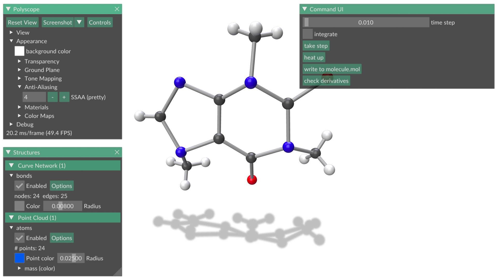

# molecular-dynamics



Skeleton code and visualization for a basic molecular dynamics simulator, provided as part of the 15-462/662 final exam at CMU.  Visualization via [Polyscope](http://polyscope.run/).


### Build the code

**Unix-like machines**: configure (with cmake) and compile
```
cd molecular-dynamics
mkdir build
cd build
cmake ..
make -j6
```

**Windows / Visual Studio**

Install CMake, and use either the CMake GUI or the command line interface (as on unix) to generate a Visual Studio solution.  Build the solution with Visual Studio.

### Run the code
```
./bin/md /path/to/a/molecule.mol
```

### Edit the code

Copy your solutions into `src/MolecularDynamics.cpp`.  Modify the main file `src/main.cpp` to change UI/visualization.  `CMakeLists.txt` contains a few comments for adding additional files.

